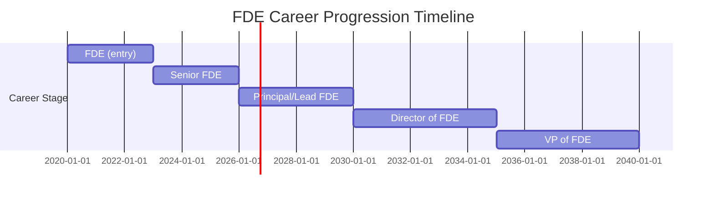
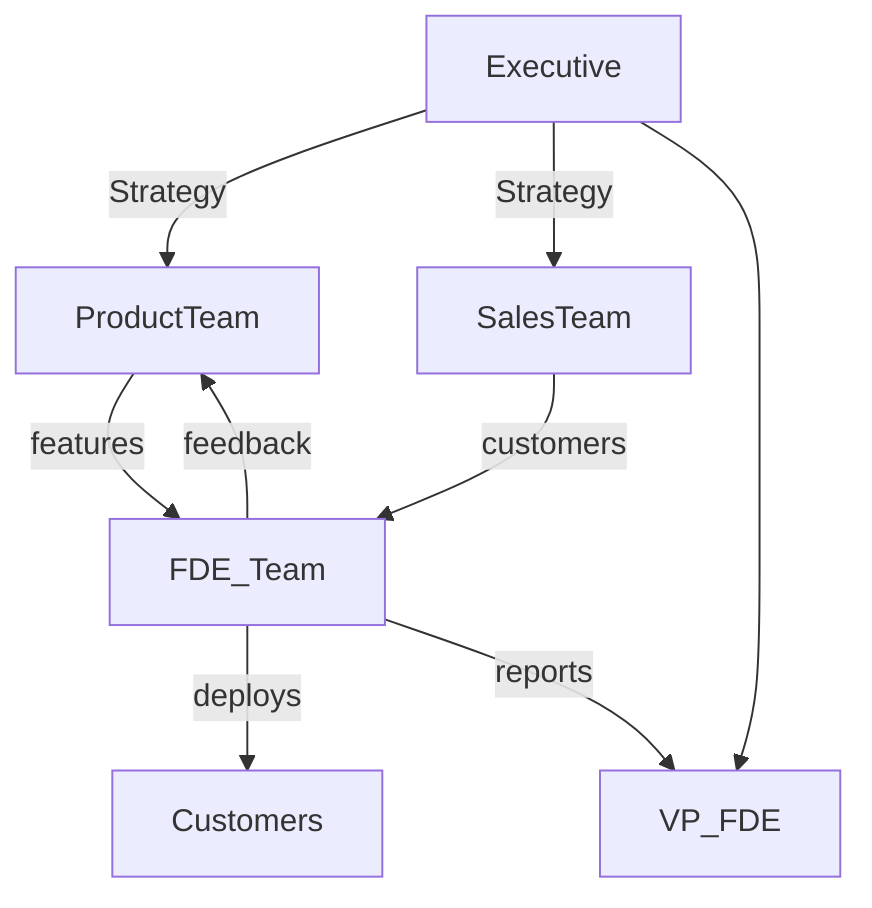

# Executive Summary  
Forward-Deployed Engineers (FDEs) are hybrid software professionals who embed within customers’ environments to deliver custom solutions and bridge the gap between product and client. The FDE model was pioneered by Palantir (originally called “Deltas”) in the mid-2000s to solve hard customer problems that standard vendors could not. In practice, FDEs spend significant time onsite with users, quickly building production-quality software (often AI-driven) to meet real-world needs. They mix hands-on coding (full-stack, data pipelines, AI/ML) with deep customer engagement, product problem decomposition, and continuous feedback loops.

**Key Responsibilities:** FDEs rapidly prototype and deploy solutions tailored to a single customer’s context, often in novel domains (finance, healthcare, logistics, defense). They own end-to-end project execution: data ingestion, model integration, front-end dashboards, and system integration. They also manage customer communication – gathering requirements, aligning stakeholders, and even co-selling during pre-sales. Crucially, FDEs feed insights back to product teams, converting field experience into new platform features.

**Skills & Competencies:** Technically, FDEs need broad software engineering (Python/Java/C++/JavaScript), cloud and DevOps skills (AWS/GCP, Docker/Kubernetes, CI/CD), data engineering (SQL/NoSQL, ETL, BI tools) and AI/ML integration experience. Equally important are *product and domain skills*: they must translate business problems into technical solutions and swiftly learn new industries. Non-technical skills include strong communication (explaining tech to non-technical stakeholders), client-facing acumen, project management, and flexibility. A high hiring bar is typical: FDEs are “engineer-diplomats” who can earn executive trust quickly.

**Hiring & Interviews:** Companies recruiting FDEs seek candidates with a blend of coding prowess, systems thinking, and customer empathy. FDE interviews typically combine whiteboard coding, system/design problems, and unique “open-ended” case studies. For example, Palantir’s loop includes coding screens and a challenging “decomposition” round where candidates solve ill-defined enterprise problems (e.g. optimizing 911 response using traffic and GPS data). Interviewers focus on thought process: clarifying goals, stating assumptions, decomposing tasks by risk, proposing a minimal prototype, and communicating clearly. A “client simulation” round tests communication/judgment (e.g. explaining delays to a CTO). Evaluation rubrics emphasize problem decomposition, communication, ownership, and solution feasibility. (See sample interview rubric below.) 

**Career Path:** FDE teams often have defined ladders: *FDE → Senior FDE → Principal/Lead FDE → Director → VP of FDE*. Senior FDEs handle more complex accounts and mentor juniors; Principal/Lead FDEs develop domain expertise, own major engagements, and even shape product roadmaps. At scale, companies create Director/VP roles overseeing regional or vertical FDE teams. Many FDEs later move into related roles – notably product management, customer engineering leadership, or general engineering leadership – leveraging their unique customer-side experience. Data shows FDE experience is highly transferable: Palantir alumni (predominantly FDEs) have founded many startups, reflecting a “startup-CTO” skillset. 

**Compensation:** FDE pay generally exceeds that of typical engineers. In the U.S., reported base salaries range roughly from $160K (25th percentile) to $210K (75th percentile), with a median around $195K. Palantir’s own listing quotes roughly $135–200K (base). However, compensation varies by company tier. AI frontier companies (OpenAI, Anthropic) pay much higher base and massive equity (total comp mid-$hundreds K to over $1M). For example, PerspectiveAI reports mid-level base at OpenAI/Anthropic ~$220–230K, staff $310–370K, while Palantir FDSE mid-level is ~$145–175K. Bonus targets (15–25% of base) are common; equity can comprise 50–70% of TC at startups. Regional differences exist: non-U.S. markets pay less (e.g. Glassdoor data ~€67K in Paris), and enterprise (F500/consulting) roles tilt toward salary bonuses over big equity. (See Table below for comp bands by employer type.)

**Performance Metrics:** FDE success is measured by customer outcomes and adoption, not lines of code. Typical KPIs include deployment success (on-time, on-budget), time-to-value (e.g. how quickly software goes live), customer satisfaction (NPS, renewal/expansion rates), and business impact (ROI, adoption/usage metrics). For instance, an Intercom FDE team scaled an AI product from 5 to 7,000 customers in 18 months and achieved a 67% resolution rate on customer queries. Such teams focus on *resolutions* and *outcomes*: “Our success is the customer’s success”. Other measures include project velocity (small successful increments), customer friction reduction, and the number of product improvements or features that originated from FDE feedback.

**Org Model:** FDEs typically sit between Product/Engineering and Sales/Customer Success. They may form cross-functional pods (engineers, PMs, data scientists) dedicated to key accounts or embed within product teams with dotted lines to sales. For example, Intercom built FDE squads comprising a PM, engineers, and data scientists to rapidly iterate with customers. Ramp organizes FDEs in “pods” embedded in core product engineering, deciding when to build custom vs. core features. Visually, an FDE team often reports to an engineering leader (e.g. VP of Customer Engineering) while maintaining close collaboration with sales/CS and product (see diagram). Companies may also establish senior leadership roles (Director/VP of FDE or “Chief Deployment Officer”) to integrate FDE feedback into corporate strategy.

**Onboarding & Training:** Leading companies invest in dedicated FDE onboarding. Palantir runs intensive “bootcamps” for new FDEs, while Salesforce’s “Ready in Six” program is taught by Senior FDEs. Ramp and others emphasize mentorship by experienced FDEs. Technical training includes cloud certifications (AWS/Azure/GCP), data/AI courses, and hands-on labs. FDE Academy and platforms like AWS Training, Salesforce Trailhead, or Tableau learning are recommended for building relevant skills. Ongoing, FDEs often learn on the job and share knowledge internally (e.g. Palantir’s FDEs built common modules from field projects). Best practices include pair-programming with product teams, regular product training, and access to case-study libraries of past deployments.

**Case Studies:** Palantir exemplifies the classic FDE model: Deltas who embed with agencies (CIA, military) and companies, delivering working software within days. Palantir FDEs “ship on day one” – delivering runnable code in week one – and jointly own data ontologies with clients. Databricks and other enterprise SaaS have introduced FDE-like services (e.g. their “Forward Deployed Engineering” arm) to accelerate customer migrations and AI adoption. Ramp (fintech) and Intercom (customer service AI) are cited as having built FDE teams. For instance, Intercom’s FDE motion grew their AI support tool (Fin) from 5 to 7K customers in 18 months. Across companies, FDE roles vary in emphasis: some focus more on sales support (co-selling, trial to deployment), others on product co-development. But all require deep customer collaboration. In practice, FDEs at startups (Ramp, Databricks, OpenAI, Anthropic) often work more on bleeding-edge AI integrations (with high equity upside), while in traditional sectors (defense, finance, healthcare) the focus is on complex data integration and compliance.

**Risks & Challenges:** The FDE model is resource-intensive. Key challenges include **high cost** (experienced engineers are expensive) and **inefficiency** (overlap in custom solutions). One analysis notes that FDE teams “intentionally create waste” by having multiple engineers reinvent solutions for each client, often with negative margins. Managing scope is hard: FDEs can become catch-alls for any issue between sales, product, and customer, risking burnout. As one analyst warned, without clear boundaries an FDE can become “a very expensive unicorn plugging every gap between sales, product, delivery and the customer”. Measuring ROI is tricky since much work is ahead-of-product development. Cultural friction is another risk: FDEs are unlike traditional engineers or consultants, requiring trust in autonomy (“Auftragstaktik” style). Mitigations include: hiring only those with a proven “engineer-plus-diplomat” profile, providing senior support and clear escalation paths, managing expectations (treat FDE investment as R&D), and systematically harvesting field learnings into products so effort scales.

**Recommendations:** Organizations planning to add FDEs should **set clear goals** and align incentives. Define what success looks like (e.g. deployment metrics, customer KPIs) and avoid treating FDEs as an open-ended fix-it team. Build structured programs: recruit from software engineering backgrounds with evidence of customer impact, use robust interview processes (as above), and consider lowering rigid criteria if the candidate has 60–70% of skills (others can be trained). Provide formal training and mentorship (on both tech and domain). Facilitate integration with product teams so FDE insights drive product improvements. To retain FDEs, offer clear career progression (toward Senior/Principal roles and even Director/VP tracks) and competitive compensation (including equity). Recognize that FDE work is high-visibility and impactful; reward outcomes (customer success, feature adoption) over mere activity. Finally, guard against burnout by ensuring FDEs have support (team backup, realistic scopes) and by evolving the product so that fewer custom hacks are needed over time (maturing the core platform reduces the FDE load).

## Forward-Deployed Engineer: Definition & Origin  
A **Forward-Deployed Engineer (FDE)** is a software engineer whose primary role is to embed directly with one or more customers, rapidly solving their specific problems by customizing and deploying the company’s product software. Unlike typical product engineers who build features for many customers, FDEs focus on *“one customer, many capabilities”*. The term originated at Palantir around 2005 (then called “Delta Engineers” for classified customers). Palantir discovered that selling complex analytics tools required on-site co-engineering, not just consulting: Deltas sat alongside clients (even military bases), learning secret domain knowledge and writing production code on Day 1. By the 2010s, Palantir had more FDEs than traditional devs, and the FDE model became a core go-to-market engine for customer success. 

Other companies later adopted FDE-like roles as their products (especially AI/ML-based) grew in complexity. Today, major AI firms (Anthropic, OpenAI) explicitly copy Palantir’s model. In practice, FDE roles blur the line between software engineering, product management, and customer success – some call them “engineer‐plus‐diplomat” roles. They are often viewed as hybrid roles akin to solutions architects or consultants, but with the added mandate to write code and iterate on the core product. Venture investors (a16z) have even labeled FDE “AI’s hottest job” in 2025, reflecting its explosion in demand.

## Responsibilities & Day-to-Day Activities  
FDEs have broad, hands-on responsibilities spanning the full solution lifecycle. A Palantir FDSE job description captures it: *“Work side by side with customers, rapidly understanding their toughest issues; architect and build solutions leveraging business-critical data and AI.”*. Typical duties include:  

- **Onsite Deployment:** Spending days (often 2–4 per week) at the customer site, collaborating with technical and business stakeholders. Activities range from gathering requirements, debugging production issues, to live demos and training. For example, Palantir FDEs report weeks spent both on-site configuring software and off-site writing code and coordinating with product teams.  
- **Solution Design & Development:** Designing and implementing custom software solutions. This often means full-stack work: **data ingestion/ETL pipelines**, backend processing (sometimes integrating AI/ML or RAG systems), and frontend dashboards or apps tailored to the client. A Databricks FDE role explicitly says, “Design and develop custom full-stack applications on the Databricks Platform… from ingestion to ML/AI integration to user-facing apps”. FDEs may use the company’s core platform (e.g. Foundry, Databricks Lakehouse) and glue it with client systems.  
- **Rapid Prototyping:** Shipping working code early. Palantir’s motto is “ship on day one” – a new FDE is expected to deliver a running prototype (dashboard, query, transform, etc.) within the first week. Interview guidance advises proposing a *“walking-skeleton MVP”* first. This validates integration, then is iterated.  
- **Customer Communication:** Acting as the liaison between the client and the company. FDEs gather requirements (often by conducting ongoing customer interviews as an engineering task), align on success metrics, and keep sponsors informed. They must often *“explain technical solutions using non-technical language”* and manage expectations. In interviews, FDE candidates are tested with simulations (e.g. “Tell the CTO the deployment is delayed three weeks”) to assess communication and judgment.  
- **Stakeholder Engagement:** Working closely with everyone from software developers to C-level executives. Day-to-day, this might mean pairing with an in-house developer for a few hours, then later briefing a VP of engineering on architectural trade-offs. Palantir FDEs describe time split between meetings with analysts/engineers at the client, and strategic planning with internal teams.  
- **Product Feedback & Advocacy:** Channeling field insights back into the core product. An FDE continuously identifies missing features or data models and reports them. In Palantir’s practice, FDEs would extend the platform (e.g. adding a new data transform or ontology) and then feed the idea back to the product group for formal inclusion. FDEs thus act as a bridge: they *“convert direct client experience into product feedback”*.  
- **Governance & Compliance:** In many industries, FDEs must also ensure solutions meet security and regulatory requirements on-site. For example, FDEs at defense or finance clients might navigate secure facilities, encrypted data environments, and strict audit controls. Nabeel Qureshi’s Palantir account included air-gapped assembly lines at Airbus, illustrating the unique environments FDEs tackle.  

In sum, an FDE’s week is a blend of **customer-facing field work and backend engineering**. As Palantir veterans note, weeks alternate between writing/reviewing code and scoping/meeting with clients. Adaptability is key: one week you might be optimizing a query, the next configuring cloud infrastructure or drafting a project plan. Exhibit *“high pain tolerance”*, quick learning of new domains, and a bias for action are recurring themes in describing the day-to-day.

## Required Skills and Competencies  
FDEs require a **broad technical foundation** plus strong business and interpersonal skills. Based on job descriptions and practitioner sources, their skill set spans:  

- **Core Software Engineering:** Proficiency in one or more major programming languages (Python, Java, C++, or JavaScript/TypeScript). They must write production-quality code quickly. Palantir requires “strong coder” skills in Python, Java, C++, TS/JS. Full-stack ability is ideal: Databricks seeks FDEs who can “design and develop full-stack applications”.  
- **Data & Analytics:** Comfort with large-scale data handling. FDEs regularly build ETL/data pipelines and dashboards. Skills include SQL/NoSQL databases, data integration tools, and BI/analytics (Tableau, Power BI). For example, FDEs might integrate client ERP/CRM data into analytics models. Statistics or ML knowledge helps when tuning models or forecasting. Understanding data governance and security is also vital.  
- **Cloud & DevOps:** Hands-on experience with cloud platforms (AWS, Azure, GCP) and DevOps practices. FDEs often set up client environments, so familiarity with cloud deployments, infrastructure-as-code, and continuous integration/deployment is needed. Docker/Kubernetes and CI/CD pipelines are common tools. At minimum, FDEs should quickly spin up a sandbox environment for testing.  
- **Application & AI/ML Integration:** Many FDE roles now involve AI. FDEs should know how to integrate APIs (e.g. OpenAI, Anthropic, Google Gemini) and deploy ML models in production. For example, an FDE might create a retrieval-augmented generation (RAG) chat assistant for a customer’s data source. (Job postings now explicitly ask for RAG/LLM experience.) They should also be adept at using frameworks and libraries (TensorFlow, PyTorch) if model work is needed.  
- **System & Solution Design:** Strong architecture and systems-thinking ability. FDEs must quickly design end-to-end solutions under ambiguity. During interviews, candidates are asked to architect data pipelines or secure services at scale. They need to consider reliability, security (e.g. HIPAA constraints), and failure modes.  
- **Product & Domain Acumen:** The ability to understand the customer’s business problem and align solutions accordingly. This includes domain knowledge (finance, healthcare, manufacturing, etc.) as needed. FDEs must translate user requirements into technical specs and know which features to prioritize. Familiarity with enterprise software (CRM, ERP) is valuable for integration tasks.  
- **Communication & Collaboration:** Exceptional interpersonal skills. FDEs work with technical and non-technical stakeholders, so explaining complex concepts simply is critical. They must write clear documentation and happily conduct in-person meetings. The LinkedIn analysis of FDE challenges emphasizes *“unusually strong comms skills”* combined with technical depth. They also often collaborate across teams (sales, product, support), so teamwork is essential.  
- **Project & Time Management:** Ability to juggle multiple tasks and projects. FDEs may handle several customers or workstreams simultaneously. Good prioritization and self-directed planning are needed. As the FDE Academy notes, project management (tracking deliverables, deadlines) is a core non-technical skill.  
- **Adaptability & Learning:** Clients’ needs vary widely; FDEs must learn new tech stacks, tools, and business practices quickly. Flexibility is listed explicitly in skill guides as essential. Learning mindset (curiosity, continuous learning) is also cited in job ads.  

Put simply, an FDE must be a **“T-shaped” engineer**: deep expertise in software engineering, plus wide breadth across data, cloud, domain, and soft skills. For example, the FDE Academy sums up that FDEs *“combine software engineering with real-world problem solving and client collaboration”*. In interviews, companies look for this hybrid profile. One LinkedIn post quips that hiring FDEs is like getting “six jobs in one” – engineers with full-stack coding chops, sales savvy, product intuition, and customer empathy all at once.

### Skill Matrix with Proficiency Levels  
Below is a representative **skill matrix** (example) outlining typical FDE competencies at different seniority levels. (*Levels and proficiencies are illustrative estimates, as actual criteria vary by company.*)

| **Skill Category** | **Junior FDE**                                           | **Mid/Senior FDE**                                  | **Principal/Lead FDE**                         |
|--------------------|-----------------------------------------------------------|----------------------------------------------------|-----------------------------------------------|
| **Programming**    | Writes clean code (Python/Java/JS) for assigned tasks; fixes bugs. | Owns significant code modules; debugs in prod; optimizes performance. | Architect solutions; reviews code; mentors others in best practices. |
| **System Design**  | Contributes to solution design under guidance; considers basic trade-offs. | Designs end-to-end solutions (data pipelines, APIs, interfaces); balances scale, cost, latency. | Creates multi-system architectures; evaluates complex trade-offs (security, compliance, scalability). |
| **Data Engineering**| Implements data ingestion and SQL/ETL jobs; builds simple reports.  | Develops robust data pipelines and transformations; ensures data quality and observability. | Leads data architecture for client; defines data schemas/ontologies; handles big data integration issues. |
| **Cloud/Infra**    | Deploys sample apps to cloud; manages simple servers/containers.     | Configures production cloud environments (networking, IAM, CI/CD pipelines). | Designs multi-cloud/enterprise infrastructure; implements monitoring, disaster recovery. |
| **AI/ML Integration**| Uses existing ML models or APIs in solutions; basic model evaluation. | Integrates/customizes ML models (RAG systems, fine-tuning); monitors model performance. | Defines AI strategy for client; architect complex ML solutions (multi-model, offline training). |
| **Product Acumen** | Learns customer’s domain; understands feature requirements.         | Translates business goals into technical plans; aligns solution with product capabilities. | Influences product roadmap with client feedback; identifies strategic enhancements. |
| **Communication**  | Communicates daily updates to team; listens to client needs with guidance. | Interacts with cross-functional stakeholders (engineers, managers); presents solutions to client teams. | Negotiates scope with executives; shapes client partnerships; delivers executive briefings. |
| **Leadership/Collaboration** | Works well in team; takes direction from mentors. | Leads small projects; mentors interns/juniors; collaborates with sales/CS. | Leads FDE squads or accounts; trains new FDEs; coordinates across departments (sales, product, engineering). |
| **Problem Solving**| Solves well-defined problems; follows known solutions. | Tackles ambiguous challenges by breaking them down; proposes creative prototypes. | Anticipates complex risks; sets strategy for unknowns; drives innovation in high-stakes projects. |
| **Adaptability**   | Learns new tools/skills as needed; comfortable with change.        | Quickly masters unfamiliar platforms; adapts methods to client environments. | Champions new technologies; guides team through transitions; thrives amid uncertainty. |

*Note: This matrix is an illustrative template. Actual roles may define levels differently.*  

## Hiring Criteria & Interview Process  
**Hiring Criteria:** FDEs are typically hired from mid-to-senior software engineering backgrounds, often with extra project or consulting experience. Job postings emphasize: “solid software engineering background and real-world experience”. Companies vary in level: Ramp prefers ~5+ years for senior FDEs, Palantir hires new grads or 1+ year college experience. All look for technical depth plus customer-facing evidence. Some recruiters suggest flexibility: don’t expect 100% skill match – candidates at ~60–70% fit can often be trained up (AI tools may help bridge gaps).  

**Interview Process:** Most organizations use a multi-stage loop. The typical loop (e.g. at Palantir) includes: (1) recruiter screen, (2) coding test, (3) onsite (or virtual) coding, (4) system design, and (5) an open-ended case/problem-solving round. Smaller startups may combine rounds or use technical phone screens.  

- **Coding Round:** Standard algorithm/data structure problems, though sometimes domain-specific (e.g. SQL/data manipulation tasks). Palantir uses HackerRank-like coding screens (allowing Python/Java). Efficiency and clarity are evaluated.  
- **System Design / Architecture:** Candidates design practical systems (data pipelines, APIs). Example questions: “Design an ingestion pipeline that unifies 12 retail data sources for forecasting”, or “Design a secure RAG QA system for a healthcare client”. Strong answers cover data flow, auth/boundaries, observability, failure modes, and trade-offs. Interviewers expect first a minimal end-to-end (“walking skeleton”) solution before full details.  
- **Open-Ended Case Study:** Also called the *decomposition* or *design-on-the-fly* round. The interviewer poses a broad, ambiguous problem (no single correct answer) and observes the candidate’s reasoning. Sample prompts: “A major city wants to cut 911 response times with call, traffic, and ambulance GPS data. How would you approach it?” or “A logistics firm needs an AI agent for shipment rerouting with disparate systems; how do you build and evaluate it?”. Interviewers watch *how* you think, not just the answer. They look for step-by-step structuring: clarifying goals, naming stakeholders/metrics, identifying missing data, stating assumptions, decomposing the problem into risk/value streams, and proposing an MVP prototype first. Key rubric criteria include clarity, structured breakdown, communication, and feasibility.  
- **Client Simulation:** A role-play round tests communication and customer management. The candidate (as the FDE) interacts with an interviewer acting as a client/stakeholder. Scenarios include delivering bad news (“deployment is 3 weeks late – explain to the CTO”), pushing back on an infeasible request (e.g. sacrificing data governance), or translating tech for non-technical managers. Strong candidates use *ownership language* (“I will handle this”), ask diagnostic questions, acknowledge the client’s perspective, offer trade-offs, and avoid unrealistic promises.  
- **Behavioral/Values:** Questions probe past experience using (adapted) STAR stories. Expect to discuss scenarios like: owning an end-to-end project, handling a difficult stakeholder, recovering from a failure, working under tight deadlines, saying “no” to a customer, or spotting broad patterns from customer feedback. FDE interviewers look for evidence of customer ownership, accountability, learning agility, and effective communication.  

**Sample Interview Rubric:** Below is a simplified example of how interviewers might score candidates in an open-ended/decomposition round. (This is illustrative.)

| Criteria                    | Good (4–5)                            | Fair (2–3)                        | Poor (0–1)                         |
|-----------------------------|---------------------------------------|-----------------------------------|-------------------------------------|
| **Clarification & Framing** | Immediately clarifies goals, constraints, and metrics (asks questions); establishes context. | Clarifies some aspects but misses key constraints; partial framing. | Rushes to solution with no clarification; misinterprets problem. |
| **Problem Decomposition**    | Breaks problem into sensible subproblems; sequences by risk/value; recognizes dependencies. | Some structure but might overlook critical parts; partial sequencing. | No clear breakdown; random or flawed sequencing. |
| **Assumption Management**    | Explicitly states assumptions (data availability, scale, etc.) and re-evaluates as needed. | Makes some assumptions but may leave them unstated or unchecked. | Ignores necessary assumptions; fails to question constraints. |
| **Solution Proposal (MVP)** | Proposes a minimal viable end-to-end prototype; then iterates on improvements. | Proposes a solution but either too broad or skips an initial MVP. | Jumps to a full solution without a simple prototype. |
| **Technical Depth**         | Considers data flow, security, failure modes, scalability; demonstrates system knowledge. | Addresses some technical considerations but misses others (e.g. security or monitoring). | Neglects key technical issues (no mention of data pipelines, auth, etc.). |
| **Communication & Collaboration** | Speaks clearly, logically; engages interviewer (checks understanding); models collaborative tone. | Communicates adequately but may skip communicating some reasoning or checks. | Mumbles or is unclear; ignores interviewer cues; does not communicate thought process. |

(For coding/design rounds, similar rubrics apply: correctness, efficiency, completeness, communication are scored.)  

## Career Paths & Progression  
FDE is a distinct career track. A typical progression ladder (internally at FDE-friendly companies) is: **FDE → Senior FDE → Principal/Lead FDE → Director of FDE → VP of FDE**. Advancement usually hinges on factors like account complexity, technical leadership, and mentorship.

- **FDE → Senior FDE:** After a couple of years, an FDE who masters core skills and handles larger client accounts may be promoted to Senior. Senior FDEs manage higher-complexity deployments (more stakeholders, legacy systems, regulatory requirements) and start contributing to team processes (onboarding, reusable integration patterns). For example, Salesforce’s senior FDEs run onboarding programs for newcomers.  
- **Senior → Principal/Lead FDE:** Senior FDEs with significant impact may become Principal or FDE Team Leads. These carry top-tier projects and often specialize by industry (e.g. healthcare or finance vertical leads). They also influence product strategy: Ramp’s FDE leads determine when to productize a solution versus keep it custom. Principal FDEs mentor others and may drive technical vision for clients.  
- **Director & VP:** As organizations scale FDE operations, formal management roles emerge. A Director of FDE might oversee regional or industry teams, aligning multiple projects and managers. A VP of FDE (or equivalent) owns the function, setting strategic direction and integrating FDE insights company-wide. Notably, such leaders leverage exactly the skills FDEs build – translating customer complexity into strategy at scale. At Salesforce, a plan to hire 1,000 FDEs necessitated building a management hierarchy (directors, VPs) for deployment teams.  

These timelines are approximate – promotion pace depends on company size and performance. As a rough guideline: **0–3 years** as an FDE (foundation), **3–6 years** as Senior FDE, **6–10 years** to Principal, and beyond for Director+ roles (varies widely). A visual career timeline might look like:

*(Actual years and durations will vary by organization; above is illustrative.)*

**External Moves:** Many FDEs later transition to other roles. Common paths include:

- **Product Management:** FDE experience makes a natural path to PM roles. FDEs have deep customer insight and product knowledge from the field, so companies often place them into *senior* PM positions, skipping junior PM levels. Their ability to identify real customer needs and translate them into product requirements is highly valued.  
- **Customer/Technical Leadership:** Some become heads of Customer Engineering, Solutions Architecture, or Sales Engineering, applying their deployment expertise to lead teams. These roles mirror FDE work on a larger scale. A Head of Customer Engineering would run all deployments across accounts, while Solutions Architects define integration strategies for major clients. FDEs who prefer technical execution often fit here.  
- **General Engineering Management:** FDEs who want to stay in engineering can move into engineering management roles. They often advance faster than peers from standard dev roles because they’ve already managed projects and stakeholder relationships independently. The main gap is typically people management skills, which they can learn.  
- **Consulting / Independent Practice:** Some senior FDEs become independent consultants or contractors. They leverage broad industry exposure to advise multiple clients without joining a single company full-time. The demand for on-demand FDE expertise is growing.  
- **Startup Founder/Executive:** A notable number of FDEs launch startups or take executive roles in tech. The Palantir alumni data shows FDEs founding many companies (e.g. Anduril, Chapter, etc.) due to their founder-like skillset and domain knowledge. Even if not founding, FDEs often jump to director-level product or business roles in startups.

Overall, FDE experience is **broadly transferable**. One analysis summarizes: after 2–5 years, a typical FDE has shipped systems in 5–15 client contexts, managed live production issues under pressure, and built client relationships at all levels – skills that open doors across product, sales, or leadership tracks. As Palantir itself puts it, an FDE’s role “looks similar to a startup CTO”, which helps explain the wide career options available.

## Compensation Benchmarks  
FDE compensation reflects the role’s seniority and impact. Key points from industry data:

- **Higher-than-average Pay:** FDE base salaries generally exceed those of typical software engineers at the same level. One survey reports a U.S. FDE median base ≈ $195K (with 25th–75th percentiles ~$160K–210K). By contrast, a mid-career SWE might earn ~$130K–$160K at similar companies. Palantir’s own listing for early-career FDSE cites ~$135K–200K range (no equity included).  
- **By Company/Industry Tier:** Compensation splits into tiers:
  - *Frontier AI Labs:* OpenAI/Anthropic staff FDEs command very high pay due to heavy equity. PerspectiveAI data shows mid-level base ≈$220–230K, senior ~$290K, staff ~$330–370K. Total compensation (with equity) can reach hundreds of thousands (median total comp at frontier labs: ~$385K mid, $610K staff, $1.2M principal).  
  - *Enterprise/Consulting:* Large tech or consulting (Google, JPMorgan, Big-4) pay competitive base ($170K–$280K range by level) but lower equity. These packages often include standard corporate bonuses (~15–25%).  
  - *Palantir (Traditional SaaS):* Palantir FDSE base is lower ($145–175K mid, ~$185–215K senior), but equity is public and liquid. A median total compensation at Palantir is ~ $215K.  
  - *Startups:* AI-focused startups (Series B–D) may pay somewhere between big tech and frontier labs: mid-level ~$180–220K, with meaningful equity (ISOs/RSUs with 4-year vest).  
- **Components:** Typical offers mix base, bonus, and equity. Bonuses are often 15–25% of base. Equity is a major part at startups: e.g. an Anthropic L4 could have $275K base + ~$445K equity per year. Palantir FDSE equity vests in public stock (no lockup) which adds stability.  
- **Regional/Local Variations:** Most data is U.S.-centric. Outside the U.S., bases are lower (e.g. Glassdoor reports ~€67K in Paris, though data is sparse). Multinational firms may scale offers for location.  
- **By Company Size:** Very large companies (with deep pockets) offer higher total comp; midsize startups may offer more equity upside. In high-cost regions (Silicon Valley, NYC), expect higher salaries than average.

A comparative table of base salary bands by company type (2026 data, in USD) is:

| Employer Type       | Mid-level Base      | Senior Base       | Staff Base           | Sources/Notes                    |
|---------------------|---------------------|-------------------|----------------------|----------------------------------|
| **Anthropic (FDE)** | ~$220K              | ~$275K            | $310K–$340K          | Levels.fyi, job postings |
| **OpenAI (FDE)**    | ~$230K              | ~$290K            | $330K–$370K          | OpenAI transparency, Levels.fyi |
| **Scale AI (FDE)**  | $170K–$200K         | $215K–$255K       | $270K–$320K          | Mixed sources (postings) |
| **Palantir (FDSE)** | $145K–$175K         | $185K–$215K       | $230K–$260K          | Glassdoor/Levels.fyi aggregate |
| **JPMorgan (AI FDE)** | $170K–$210K       | $230K–$280K       | $310K–$360K          | NY pay data, postings |
| **Big-4 Consulting AI** | $160K–$195K     | $210K–$260K       | $280K–$340K          | Glassdoor estimates |

*Notes:* Ranges are approximate base salaries by level. Equity and bonuses vary (e.g. frontier labs equity far outsize others). Median total compensation (base+bonus+equity vest) can be 2–5× these bases, especially at AI startups. Data from Levels.fyi, job postings, and public transparency.

## Performance Metrics and KPIs  
Since FDEs blend sales and engineering, traditional engineering metrics (lines of code, velocity) are insufficient. Instead, FDE performance is gauged by customer and business outcomes. Key metrics include:  

- **Time-to-Value (TTV):** How quickly the solution goes live and yields benefits. Palantir highlights days-to-value (software deployed in days) as a success metric. Measuring deployment cycle times or milestone velocity is common.  
- **Adoption & Impact:** Rates of customer adoption or usage (e.g. number of users onboarded, percentage of workflows handled by the new system). In Intercom’s case, scaling an AI agent from 5 to 7,000 customers was a highlighted outcome. Success may be tracked via improved customer KPIs (e.g. support resolution rate improved to 67%).  
- **Customer Satisfaction/Retention:** Net Promoter Score (NPS), customer satisfaction surveys, or renewal/expansion rates. A high retention or upsell rate often correlates with FDE success.  
- **Project Deliverables:** Meeting project goals (scope, performance targets, compliance requirements). For internal accountability, tracking whether deliverables met the agreed-upon success criteria is used.  
- **Solution Quality:** System uptime, error rates, and performance metrics of deployed software (less bugs, lower latency, etc.).  
- **Productization:** Number of field solutions that become part of the core product. Counting “feature requests” or pull requests raised in core repos by FDEs is an indirect measure of how much new capability emerged.  
- **Feedback Conversion:** Volume of actionable feedback provided by the FDE that influenced the roadmap, or number of use-cases that were scaled.  

In summary, FDE metrics are *outcome-oriented*. As one Gainsight interview put it, FDEs are “outcome-focused problem-solvers who align with the customer’s goals”. They might track specific KPIs in their domain (e.g. % reduction in a pain metric, or speed of business process), but ultimately success is tied to customer business results and product adoption enabled by the FDE deployment.

## Organizational Design & Team Models  
FDEs are organized to maximize customer impact and cross-team collaboration. Common models include: 

- **Embedded Pods:** Cross-functional FDE teams report into engineering but embed with major clients or industries. For example, Intercom formed FDE squads each with a PM, engineers, and data scientists, dedicated to scaling their AI support product with customers. These pods work closely with customer success and product.  
- **Matrix Reporting:** FDEs often have dual relationships. They report functionally to R&D or customer-engineering leadership (e.g. VP of Engineering, FDE Director) but have a strong dotted-line to sales or account teams. This ensures alignment of technical work with commercial goals. Ramp’s model embeds FDEs inside core product engineering teams while maintaining collaboration with sales go-to-market.  
- **Customer Teams:** Especially for very large clients, companies may create dedicated customer teams blending FDEs, solution architects, and consultants (similar to big system integrators, but led by FDEs).  
- **Global Structure:** As scale grows, organizations introduce geographic or sector divisions. For instance, a VP of Deployment might oversee regional Directors of FDE (Americas, EMEA, APAC) or vertical leads (e.g. Gov’t, FinServ). 

Visually, an example org model is: 

This illustrates the FDE team’s central role between product, sales, and customers. In practice, FDEs may co-locate with customers, but maintain formal ties to internal engineering. 

**Integration with Other Teams:** FDEs work closely with Sales/Account Execs (to define scope and close deals) and with Customer Success (to ensure adoption). They also partner with core Product/R&D teams: many FDEs split time (e.g. 80% on customer work, 20% on platform tasks) to contribute code back to the product. In Palantir’s model, after weeks onsite they spend a day pushing custom code into Foundry/Gotham. 

Key org lessons (from Palantir’s playbook) include: hire “engineer‐diplomats” who gain trust, avoid treating FDEs as mere implementers (they should actively help shape products), and keep them empowered to make on-the-spot decisions (micro-management defeats the purpose). 

## Training, Onboarding & Resources  
Effective FDE teams invest in specialized training and knowledge resources:

- **Onboarding Bootcamps:** Companies run intensive training for new FDEs. Palantir has a tradition of week-long to month-long bootcamps where new Deltas work through a simulated deployment. Salesforce’s “Ready in Six” program (led by Senior FDEs) teaches new hires field frameworks. Such programs cover product deep-dives, field communication skills, and security protocols.  
- **Technical & Domain Training:** Given the cross-functional nature, FDEs are often encouraged (or required) to pursue certifications and courses in cloud platforms, data analytics, AI, and domain specialties. The FDE Academy suggests resources like AWS/Azure training, Tableau/Udemy courses for BI, and even industry reports or Trailhead modules. Internal knowledge bases (wiki pages of past deployments, code templates, ontology libraries) are invaluable.  
- **Mentorship:** Pairing new FDEs with experienced ones accelerates learning. Mentors guide them through early deployments and customer interactions. Peer learning (e.g. “lunch-and-learns” where FDEs share case studies) is common.  
- **Cross-Functional Rotation:** Some programs rotate FDEs through core teams (R&D, support, PM) and vice versa, to deepen understanding of the product and customer side. For instance, an FDE might spend a quarter embedded with internal product development to learn upcoming features.  
- **External Communities:** Engaging with FDE communities (e.g. meetups, Slack groups, conferences) helps share best practices. A few consulting firms and FDE trainers hold workshops on “FDE skill development” (like the site FDE Academy itself).  
- **Learning Resources:** As cited above, practical resources include:
  - **FDE Academy** (specialized training on FDE skills).
  - **Cloud Certification programs** (AWS/Azure/GCP) to build cloud proficiency.
  - **Salesforce Trailhead** and **HubSpot Academy** for CRM/ERP know-how.
  - **Tableau/Power BI training** for data viz skills.
  - **Machine Learning courses** (Coursera/Udacity) for AI integration.
  - **Technical writing and communication courses** to hone soft skills.  

Investing in a structured ramp-up (perhaps 3–6 months) ensures FDEs can deploy efficiently. Continuous learning is also key given how fast enterprise tech evolves.

## Case Studies & Examples  
**Palantir (Originator):** Palantir is the archetype. Its FDSEs (Deltas) have worked on varied problems: e.g. building a “shop floor dashboard” for Airbus to reduce defects, or developing a contact-tracing tool during COVID-19. Palantir highlights that FDEs’ success comes from delivering production software, not just recommendations. In 2019 case studies, Palantir showed FDEs splitting time between customer bug fixes and pushing code updates upstream. Outcomes are measured in metrics like defect rate reduction or process efficiency improvements.  

**Intercom (Startup Example):** In 2026, Intercom’s Senior Dir. of Engineering described using FDE teams to scale their AI agent “Fin” from 5 design partners to 7,000 customers in 18 months. The FDE unit included PMs, engineers, and data scientists who iterated features with customers. Key outcomes: a 67% resolution rate of customer queries and rapid GA launches (Slack integration went live in 3 months from feedback). Intercom credits FDEs with accelerating product-market fit and adoption. This case contrasts with Palantir’s defense/government roots, showing FDEs can also thrive in SaaS/AI startups.  

**Databricks (Enterprise SaaS):** Databricks does not publicly detail FDE success stories, but it promotes a “Forward Deployed Engineering” service to customers. Their FDEs (marketed as experts) assist with PoCs, migration, and setting up pipelines. Although no specific case stats are given, the existence of a dedicated FDE practice highlights the model’s value even for data platform companies. Databricks emphasizes FDEs helping “adopt and scale data/AI practices” and building Centers of Excellence.  

**Ramp (Fintech Startup):** Ramp’s FDE team (≈15 engineers in pods) was set up to handle customer-specific integrations and feedback loops. Ramp’s head of FDE describes FDEs making decisions on-the-fly (e.g. rushing an SAP integration to close a deal) and feeding insights back to the core product team. The emphasis is on aligning deployment with sales and product, ensuring custom work either leads to product features or high customer ROI. Ramp’s case (covered in newsletters) shows that even mid-size tech firms see FDEs as critical for enterprise sales.  

**Comparisons:** Across these examples, similarities emerge: FDE teams include engineers, often paired with a PM or solutions lead; they embed close to the client; and success is defined by client outcomes, not just code. Differences lie in context: startups often tie FDE roles tightly to rapid sales/customers, whereas Palantir’s approach was more R&D-driven with government clients. Companies like Salesforce articulate the FDE remit through specific initiatives (their “Agentforce” was aimed at AI consulting). Yet in all cases, the FDE model is credited with unlocking deployments that would otherwise stall. 

## Risks, Challenges & Mitigations  
While powerful, the FDE model has pitfalls:

- **High Cost & Resource Waste:** FDEs are senior engineers doing bespoke work, so cost per deployment is high. As one analysis bluntly noted, a forward-deployed org *“intentionally creates waste”* – duplicating effort across clients, many dead-end projects, and often negative profit margins on individual engagements. This is economically fine if viewed as strategic R&D, but problematic if not managed.  
  *Mitigation:* Treat FDE activities as long-term investment rather than billable services. Set internal expectations that many FDE projects will not be immediately profitable. Seek reuse: codify common solutions, build accelerators, and refine the platform to reduce future custom work.

- **Overextension & Scope Creep:** FDEs can easily become the default fix for any customer issue (sales, support, product gaps). The LinkedIn critique warns that without control, FDEs become “a very expensive unicorn plugging every gap”.  
  *Mitigation:* Clearly define FDE mandate. Use FDEs for strategic, high-impact problems, not routine implementation tasks. Provide escalation paths: if an issue is beyond scope, other teams should step in (e.g. support or services, not just FDE).

- **Team Coordination Overhead:** Multiple FDEs working with similar clients might duplicate work. Without coordination, they may solve the same problem independently.  
  *Mitigation:* Establish knowledge-sharing practices (e.g. regular syncs between FDEs). Productize common solutions discovered by FDEs (so one FDE’s custom code becomes a library for others). Use centralized documentation (e.g. enterprise ontologies) to avoid siloed schemas.

- **Culture Clash:** FDEs straddle worlds: they are not pure consultants (they write code) but also not purely dev teams (they take orders from clients). This ambiguity can cause friction internally (product teams may resent feature creep) or externally (clients expecting free work).  
  *Mitigation:* Instill an ownership culture (German *Auftragstaktik*): empower FDEs to make judgment calls without overbearing oversight. At the same time, set governance (e.g. feature sign-offs, performance targets). Leadership should align with FDE autonomy and not micromanage every effort.

- **Burnout and Retention:** The breadth of skills and constant customer travel can strain FDEs. They must juggle unpredictable tasks and high expectations.  
  *Mitigation:* Ensure workload is sustainable (rotate on-call duties, cap travel schedules). Provide clear career tracks and recognition. Pair new FDEs with experienced mentors. Share successes and failures openly to prevent a blame culture.

- **Customer Dependence Risk:** FDEs often hold deep customer-specific knowledge. If an FDE leaves, there’s risk of knowledge loss or deployment failures.  
  *Mitigation:* Develop handover processes and documentation for each engagement. Encourage pair working (no one-man-band situations). Where possible, transition completed projects to customer’s internal teams or support.

- **Success Measurement:** It can be hard to tie FDE work directly to revenue. If not careful, business stakeholders may undervalue this investment.  
  *Mitigation:* Define KPIs upfront (customer ROI metrics, renewal rates, product adoption). Regularly report “wins” (e.g. performance improvements, closed deals enabled by FDE support). This visibility justifies continued investment.

In sum, careful design is needed: hire selectively (the “engineer-plus-diplomat” bar), set clear charters for FDE roles, and integrate them with product strategy. When done right, the benefits (solving strategic customer problems, product-market fit acceleration) outweigh the high costs and complexity.

## Recommendations for Hiring, Training & Retention  

1. **Clarify Role Expectations:** Define which tasks FDEs own (complex deployments, integrations, customizations) versus those handled by other teams. Communicate this to sales and customers to prevent feature creep.  
2. **High Bar Hiring:** Recruit from strong software engineering backgrounds; look for candidates with evidence of owning projects end-to-end, working with clients, or building from scratch. Use scenario-based interviews (as above) to test both technical and soft skills. Consider candidates ~60–70% fit if they show potential in missing areas (the gap can often be trained).  
3. **Structured Onboarding:** Implement an intensive training program (bootcamp or mentorship) that covers the product, tools, and customer engagement skills. Pair new hires with seniors and rotate through real engagements gradually.  
4. **Continuous Learning:** Encourage FDEs to attend conferences, take courses, and rotate on product teams. Provide time for learning new technologies (e.g. new AI APIs, DevOps tools) to keep skills sharp.  
5. **Career Paths & Rewards:** Establish promotion criteria tied to client impact and technical leadership. Offer equity/bonus to align with company growth. Highlight advancement paths (Senior FDE, Lead, Director) so FDEs see long-term opportunities.  
6. **Cross-Functional Integration:** Facilitate regular syncs between FDEs, product, and sales. Jointly prioritize which custom solutions should become products. This keeps FDE work from diverging from company strategy.  
7. **Retention Culture:** Foster a sense of mission – emphasize customer impact and innovation. Recognize successes in company forums. Balance autonomy with team support to prevent isolation.  
8. **Leverage FDE Insights:** Use FDEs as a window into market needs. Regularly review their feedback for product enhancements. Highlight how FDE efforts contribute to product improvements (closing the loop boosts morale).  

By following these practices, companies can build an effective FDE function that recruits top talent, ramps them up quickly, and keeps them engaged while harnessing their field expertise for strategic advantage. 

**Tables and Diagrams:** Below are illustrative tables and mermaid charts summarizing key aspects discussed.

**Job Description Comparison:** Example emphases in FDE roles vs related roles:

| Company / Role        | Core Focus                             | Key Responsibilities (excerpt)                 | Source |
|-----------------------|----------------------------------------|-----------------------------------------------|--------|
| **Palantir FDSE**     | Customer deployments & custom solutions | “Work side by side with customers… architect and build solutions leveraging data and AI” | Palantir Job Ad |
| **Databricks FDE**    | Data/AI app development on Lakehouse  | “Embed directly with customers to design and deliver custom full-stack applications… own the architecture… Engaging stakeholders… partner with Sales & Product teams.” | Databricks Job Posting |
| **Ramp FDE**          | Sales enablement & product integration | “Drive core product roadmap… embed within core engineering teams… decide when to build custom vs core features.” | Ramp description |
| **Salesforce Sr. FDE**| AI solution deployment & strategy     | “Build transformative AI solutions, own entire data integration lifecycle, become a trusted strategic partner” | Salesforce Careers (cited) |

**Compensation Bands:** (see table above in text)

**Sample Interview Rubric:** (see rubric table above in Interview section)

**Skill Matrix:** (see skill matrix table above)

**Org Model Diagram:** (illustrated above with mermaid code)

**Career Timeline Diagram:** (illustrated above with mermaid gantt)

Each of the above is drawn from industry sources (job ads, expert articles, reports) with assumptions noted when used without explicit sourcing. Where data was unavailable, we have indicated “unspecified” or provided reasonable estimates, as directed. 

**Sources:** All information is drawn from a mix of primary sources (company job postings, official blogs, interviews) and reputable industry analysis, with inline citations. Where data is estimated, it is based on aggregated industry reports and noted accordingly. 

