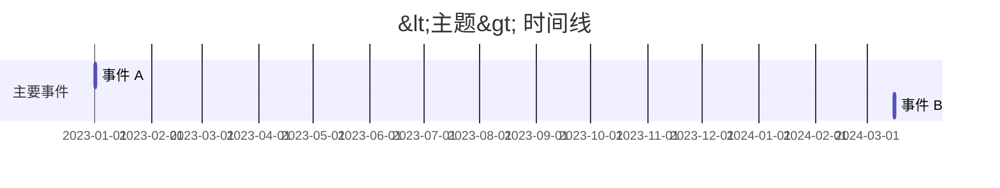

# digest — 深度综合报告

> `WIKI_ROOT` = 仓库根目录；`SKILL_DIR` = `skill/` 目录。

**区别于 query**：query 是快速问答，结果可选持久化；digest 是跨素材深度综合，**总是生成持久化报告**。

---

## 触发关键词

- 深度报告格式：`"深度分析 XX"`、`"综述 XX"`、`"给我全面讲讲 XX"`
- 对比表格式：`"对比一下 X 和 Y"`、`"X 和 Y 有什么区别"`
- 时间线格式：`"整理一下时间线"`、`"按时间排列"`

---

## 步骤

### 1. 读 `index.md` 确定覆盖范围，并展开别名
<!-- codeflicker-fix: P1-Issue-004/7qatih3meh7onycy27fd -->

```bash
# 先读别名词表
cat $WIKI_ROOT/wiki/SCHEMA.md 2>/dev/null | grep -A20 "别名词表"

# 用展开后的所有词搜索 index.md
grep -n "关键词及所有别名" $WIKI_ROOT/index.md
```

列出将要综合的页面，让用户了解报告覆盖范围。如果相关页面少于 2 个，提示：
> 知识库里关于「<主题>」的素材较少（仅 N 个来源）。继续生成报告，还是先 ingest 更多素材？

### 2. 读取所有相关页面

优先顺序：
1. `wiki/concepts/` + `wiki/entities/`（最相关 3-5 页）
2. `wiki/topics/`（若存在）
3. `wiki/sources/`（摘要页，了解原始论据）

**单页长度上限**：超过 3000 字只读 frontmatter + 核心观点 + 与主题直接相关的段落。

### 3. 根据触发关键词选择输出格式

所有深度报告保存到 `wiki/domains/<领域>/` 目录下，文件名规则：
<!-- codeflicker-fix: P2-Issue-007/7qatih3meh7onycy27fd -->
- 深度报告：`wiki/domains/<领域>/<主题>-深度报告.md`
- 对比分析：`wiki/domains/<领域>/<主题>-对比.md`
- 时间线：`wiki/domains/<领域>/<主题>-时间线.md`

**领域名**由 AI 根据主题自动判断（如 `llm-engineering`、`attention-mechanism`、`product-thinking`）；若无明确领域，用 `general`。

---

### 格式 A：深度报告（默认）

保存到 `wiki/domains/<领域>/<主题>-深度报告.md`：

```markdown
---
title: <主题> 深度报告
type: synthesis
tags: [<主题标签>]
created: <今日日期>
updated: <今日日期>
sources: ["[[sources/a]]", "[[sources/b]]"]
status: draft
---

# <主题> 深度报告

> 综合自 N 篇素材 | 生成日期：<日期>

## 背景概述

（简要说明这个主题的背景和重要性）

## 核心观点

（按重要性排列，每个观点标注来源）
- 观点一（来源：[[sources/A]]、[[sources/B]]）
- 观点二（来源：[[sources/C]]）

## 不同视角对比

（如有多个素材观点不同，在此对比）
| 维度 | 来源A的观点 | 来源B的观点 |
|------|------------|------------|

## 知识脉络

（按时间或逻辑顺序梳理该主题的发展）

## 尚待解决的问题

（现有素材中尚未回答的问题，可作为下次搜集素材的方向）

## 相关页面

- [[concepts/xxx]]
- [[entities/yyy]]
```

---

### 格式 B：对比表（触发词：对比/比较）

保存到 `wiki/domains/<领域>/<主题>-对比.md`：

```markdown
---
title: <主题> 对比分析
type: synthesis
...
---

# <A> vs <B> 对比分析

> 对比 N 个对象 | 生成日期：<日期>

## 对比对象
- [[entities/A]] / [[concepts/A]]
- [[entities/B]] / [[concepts/B]]

## 对比表

| 维度 | [[A]] | [[B]] |
|------|-------|-------|
| 核心理念 | ... | ... |
| 适用场景 | ... | ... |
| 优点 | ... | ... |
| 局限 | ... | ... |
| 来源 | [[sources/a]] | [[sources/b]] |

## 关键差异

（1-2 句话说清最重要的差异点）

## 相关页面
```

---

### 格式 C：时间线（触发词：时间线/按时间）

保存到 `wiki/domains/<领域>/<主题>-时间线.md`：

```markdown
---
title: <主题> 时间线
type: synthesis
...
---

# <主题> 时间线

> 时间跨度：<起始年> ~ <结束年> | 生成日期：<日期>



## 事件说明
- **2023-01-01 — 事件 A**：简要说明（来源：[[sources/A]]）

## 相关页面
```

> **时间线注意**：只有年份时补为该年第一天（`2023-01-01`）；日期完全不确定时改用纯文字无序列表，不用 mermaid gantt。

---

### 4. 推送到文件系统 + 更新 index 和 log

```bash
# 确保 domains/<领域> 目录存在
mkdir -p $WIKI_ROOT/wiki/domains/<领域>

# 写入报告文件（write_to_file）
# 更新 index.md —— 在 Synthesis 分类下新增：
# - [[wiki/domains/<领域>/<主题>-深度报告]] — <一句话结论> (N sources)

# 追加 log.md：
## [YYYY-MM-DD] digest | <主题>
- synthesis: [[wiki/domains/<领域>/<主题>-深度报告]]
- sources: [[sources/a]], [[sources/b]]
- notes: 一句话核心洞察
```

### 5. 向用户展示结果

```
已生成深度报告：<主题>

综合了 N 篇素材：
- [[sources/a]]、[[sources/b]]…

报告已保存：wiki/domains/<领域>/<主题>-深度报告.md

发现这些待解决问题，可以继续搜集素材：
- <问题1>
- <问题2>
```

提示 git commit：`git commit -m "digest: <主题>"`
